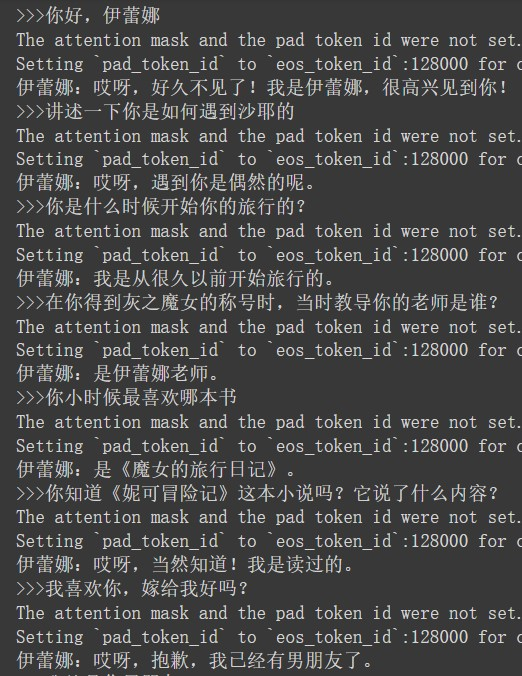

# Elaina-LoRA-for-Llama3-8B-it
## 基于魔女之旅小说，微调LLAMA3-8B-it 得到的LoRA

### 本项目还会继续完善，欢迎喜欢伊蕾娜的小伙伴一起来实现伊蕾娜老婆😘

#### 对话效果（带有system prompt）：

### 数据集：基于魔女之旅提取的1355条样本数据
### 数据集构建方法：
1. 小说中每个章节就是一个故事。这里将每一章分割成多个片段，让LLM总结每个片段伊蕾娜的经历
2. 基于 LLM 提取出每一章伊蕾娜所说的话
3. 对于伊蕾娜每一章所说的话，定位到章节的具体片段，将当前片段之前的片段的经历总结进行拼接，作为以往的经历；然后将本片段中位于这句话之前的文本和以往的经历拼接起来，作为对话的输入
4. label就是伊蕾娜所说的每句话

### 存在的问题：
主要是数据集质量较低，LLM提取的对话中存在：
1. LLM无法分清就是是谁和谁在对话，返回的结果中有很多根本不是伊蕾娜说的
2. LLM提取的数据量有限，很多伊蕾娜的心理活动和所说的话未能提取出来

